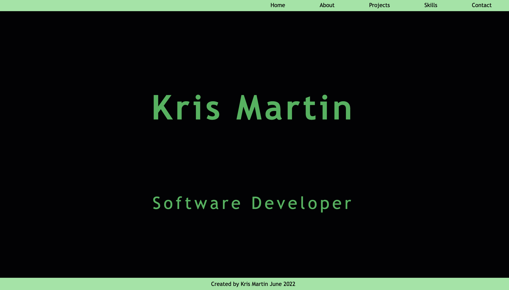

# Portfolio

## Description

This is a draft portfolio. It uses HTML5, SCSS/CSS3 and JavaScript. It is a work in progress. You can view it here:

https://kris-martin.github.io/portfolio/

## Things to work on include:

-   fix overflow bug on about page - full scrollbar does not show without padding
-   landing page - picture and/or animation
-   carousel for projects - bootstrap / replace radio buttons
-   icons for tech used in projects on project slides
-   clipboard email instead of default email - use javascript function
-   consider rewriting in React

## Project Brief

Create a portfolio to showcase what you will be learning in the course, and to give visitors an insight to who you are.

## MVP

-   a public repository on GitHub
-   a README.md with a short intro to the project.
-   use SCSS for styling.
-   use B.E.M as a naming convention.
-   make sure website is responsive

Your Portfolio should have the following sections:

-   Landing section with your name and title on it.
-   About section with a little bit about you
-   Tech stacks/skills section with all the tech you have learned during the course
-   Projects section with all your projects:
    -   use placeholder images and text at the beginning to render your website as it would with actual projects
    -   small description of project
    -   link to a live version
    -   link to the matching GitHub Repo
        -   projects should have a README.md at the root of their repo including how you went about coding the project
-   Contact section with your email, GitHub profile link, LinkedIn profile link
